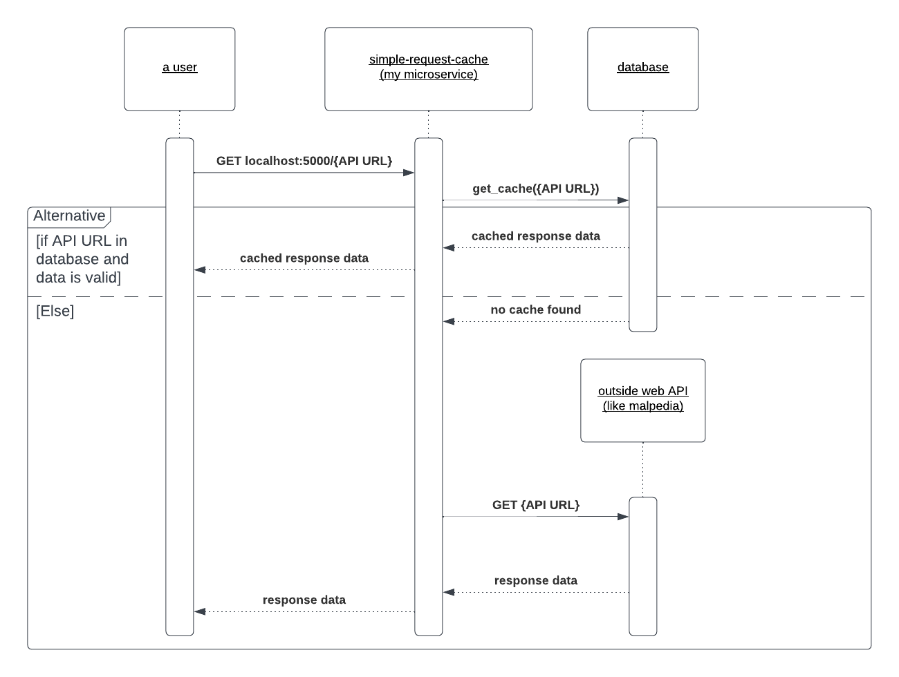

# simple-request-cache

I'm writing this as part of one of my Software Engineering class projects.

This microservice receives and forwards HTTP GET requests to their destination and returns the responses. For successful requests, the data and corresponding URL's are stored in a SQLite database that serves as a cache with a 30 day (default) invalidation period. This cuts down on response times for repeat requests.

To run this microservice locally, install Python 3.6+ and then download or clone this repository. `cd` into the directory containing these files and install all dependencies by typing `pip install -r requirements.txt`.

From there, the simplest way to use this microservice is by typing:
`python main.py` (or `python3 main.py` for some users) to start the microservice locally on port 5123.

## A. To request data from this microservice

Make a GET request for the web API that you want to use by appending the URL to localhost:5123.

For example, send a GET request to:
`localhost:5123/https://malpedia.caad.fkie.fraunhofer.de/api/find/actor/anon`

or

`localhost:5123/https://api.weather.gov/points/39.7456,-97.0892`

This microservice will then receive the request with the expectation that it is JSON (other Content-Type headers are not supported).

## B. To receive data from this microservice

To receive data, the requester must accept a JSON response that is in the format of whatever the external service that the requester sent gave.

For example, in response to `localhost:5123/https://malpedia.caad.fkie.fraunhofer.de/api/find/actor/anon` the following is returned to the requester:

```
[
  {
    "common_name": "Anonymous Sudan",
    "name": "anonymous_sudan",
    "synonyms": []
  }
]
```

along with a status code of 200. If the request failed, then whatever status code was given by the requester's URL is returned with no modification.

After a successful call, all repeat calls to the same URL within the next 30 days will yield the same result. The persistent data is stored in a SQLite file named `cache.db`, which is created when `python main.py` is first run.

## C. UML Sequence Diagram



## Other information

If the user wants to modify the cache invalidation period, add a base URL string, or change the port number used by this microservice, this can be done via command line arguments. 

This information can be viewed by typing `python main.py --help` or viewing below:

```
python main.py --help
usage: main.py [-h] [--port PORT] [--maxelapsed MAXELAPSED] [--baseurl BASEURL] [--nodebug]

Start simple request cache service.

options:
  -h, --help            show this help message and exit
  --port PORT           port to use
  --maxelapsed MAXELAPSED
                        max time (integer seconds) before invalidating cache
  --baseurl BASEURL     base url prefix for all requests
  --nodebug             disables hot reloading and debug messages
```
